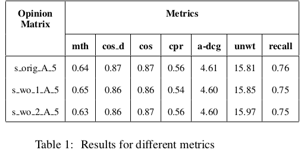
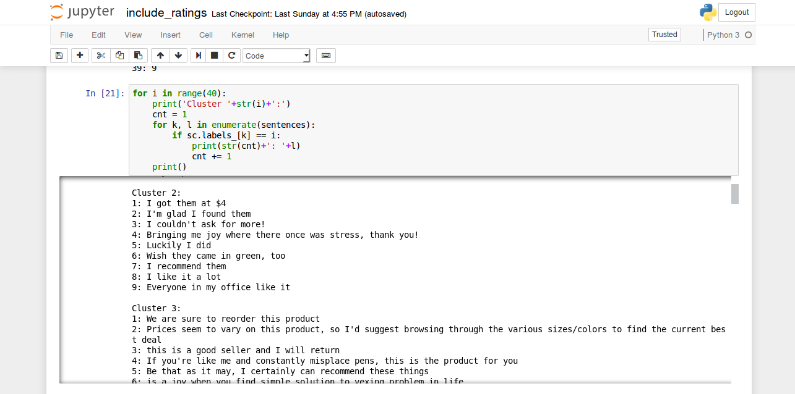
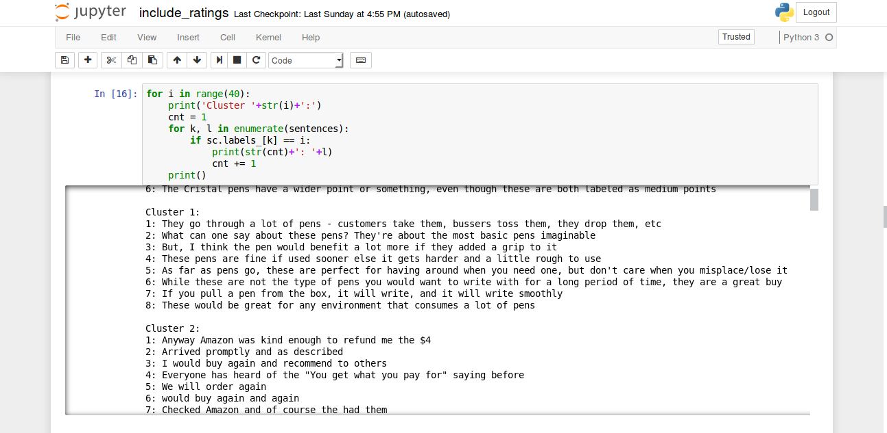
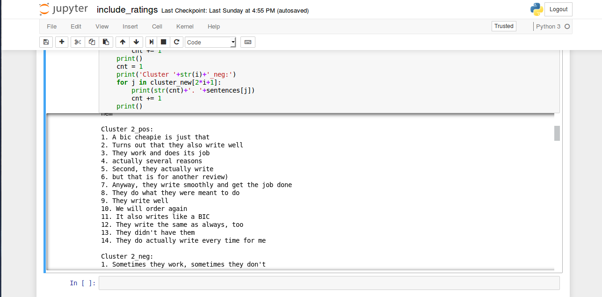

Review Opinion Diversification
==============================

A project I worked on in my 3rd Semester. [RevOpiD](https://sites.google.com/itbhu.ac.in/revopid-2017) was a shared task in IJCNLP 2017, Taipei, Taiwan.

I implemented three approaches of solving the problem -  
1. Opinion Feature Mining (**Mining Opinion Features in Customer Reviews** (Liu et al.))
2. Doc2Vec Model and Clustering
3. Facebook Research's [InferSent](https://github.com/facebookresearch/InferSent) model for sebtence embeddings with Clustering

Three clustering techniques were tried -
* K-Means Clustering
* Spectral Clustering
* Agglomerative Clustering

Of the three, Spectral Clustering gave the best results on manually checking the contents of the clusters. So in all the description of the models, clustering implies Spectral Clustering.

## Opinion Feature Mining

This implementation was based on Bing Liu's [paper](https://www.cs.uic.edu/~liub/publications/kdd04-revSummary.pdf). The implementation involved the use of Core NLP concepts.

### Steps involved in the implementation
1. **Pre-processing of dataset**
  * Stopwords removal
  * Lemmatising
  * Spelling correction  

2. **Noun Phrase Extraction** – Used NLTK Chunker with a RegEx pattern to extract Noun phrases

3. **Frequent Feature Generation** – Used Association Rule Mining to mine frequent occurring phrases. We run CBA(Bing Liu) [(Implementation)](http://cgi.csc.liv.ac.uk/~frans/KDD/Software/CBA/cba.html), an Association Rule Miner based on the Apriori Algorithm.

4. **Feature Pruning** -
  * **Compactness Pruning** - This method aims to remove those features that have atleast two words and are likely to be meaningless.
  * **Redundancy Pruning** - This step mainly focuses on removing redundant features containing single words.  

5. **Opinion Words Extraction** - Opinion words are words that people use to ex-
press a positive or negative opinion. Extract the closest adjective in the neighbourhood of a feature occurring in a sentence, this adjective is considered to be the opinion for that feature.

6. **Orientation Identification for Opinion Words** - For each opinion word we found for the different features, we need to identify and give its semantic orientation. Used adjective-synonym set in WordNet (We used NLTK implementation of WordNet for this purpose). The synonyms were found from the synsets of the word and antonyms were included from the antonyms list for each lemma of the synsets of the word.
For this purpose two functions were implemented -
  * ***Orientation Search*** - It searches the WordNet and the seed list for each target adjective word to predict its orientation. If there exists a synonym of that adjective in the seed list, then the adjective is added to the seed list with the same orientation as that of its synonym. Otherwise, the function continues to search the antonym set of the target word in WordNet and checks if any antonym is in the seed list i.e has known orientation. If so, the target orientation is set to the opposite of the antonym and the adjective is added to the seed list.  
  * ***Orientation Prediction*** - This function repeated calls the Orientation Search function with the opinion list and seed list as parameters. It checks the size of the seed list before and after calling the Orientation Search. It repeats the process until both the sizes come out to be same i.e no word was included in the seed list in that call to the Orientation Search. The reason why Orientation Search is called many times is that it may be possible that a word’s orientation may be found in a later call of the procedure with an updated seed list. For those adjectives that WordNet cannot recognize, they are discarded as they may not be valid words and for those that we cannot find orientations, we assign them a neutral orientation. Also, for the case that the synonyms/antonyms of an adjective have different known semantic orientations, we use the first found orientation as the orientation for the given adjective.  

7. **Opinion Matrix Formation** - We decide to take the most frequently appearing nouns/noun phrases(features). This is implemented by taking the nouns from the saved positive, negative and neutral opinions list and sorting them in reverse order of their frequency in the entire text of reviews. We then take the 20 most common nouns from the sorted list. satisfied then we mark a ‘1’ in the column corresponding to that list of opinions, otherwise, put a ‘0’.

 

## Sentence Embeddings

We also approached the problem with Deep Learning Techniques, using Sentence Embeddings. We used two approaches for Sentence Embeddings -  
 * Doc2Vec
 * InferSent

### Doc2Vec

  1. **Making embeddings** - We consider all the products’ reviews as our collection of documents. We first store the reviews of all the products individually giving each of them a label (required for clustering later). We train our Doc2Vec model using two techniques – DBOW and DM, making 300 dimensional embeddings in both techniques. On analysing results of the similarity between documents and words, we find DBOW model performs better(Surprisingly).

  2. **Clustering** – We apply K-Means clustering on the embeddings in hopes of grouping similar documents (here, reviews) together. However, the results were not that good.

### InferSent

This is a sentence embedding model given by [Facebook Research](https://github.com/facebookresearch/InferSent).

1. **Make embeddings**    

    **Approach 1** - Used GloVe to build vocabulary. Here we first try to train and build embeddings on the review level. But on analyzing the similarity and clusters (discussed later), we find that its performance is quite poor. So we split the reviews into sentences and perform the same operations at the sentence level.  

    **Approach 2** – Further, split the sentences at Conjunctions like ‘and’ and ‘or’ and treat those as sentences.  

    **Approach 3** – Average of word vectors using Word2Vec.

2. **Spectral Clustering** – As performed with Doc2Vec, we perform clustering on the embeddings obtained. This groups the similar sentences (which mostly describe a particular feature together). To improve the results, we try considering the ratings of the reviews as well. Two approaches -
  * Append the rating of the review to which the sentence belongs at the end of the embedding for each review. However, doesn’t help much. Although improves the results a bit.
  * Try splitting the clusters performed using the original technique, into positive and negative clusters, by considering a threshold value of 3.0 and above for positive reviews and lower for negative reviews. This shows improvements in separating positive and negative opinions.

### Screenshots

  1. **Original Clusters**  
    

  2. **Appended ratings at the end of each embedding**  
    

  3. **Splitting clusters**  
    
